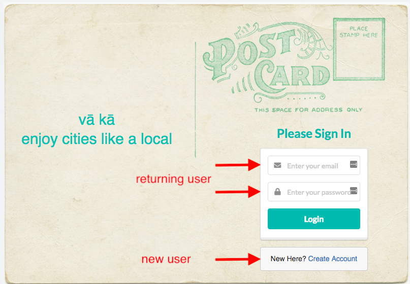
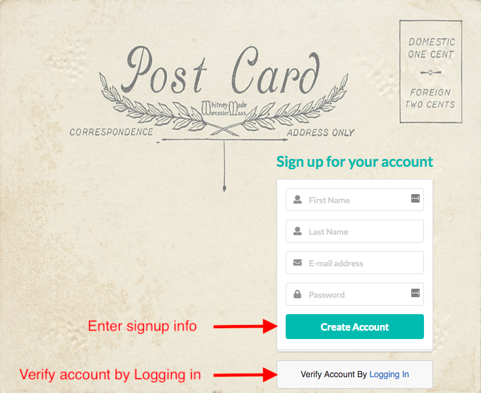
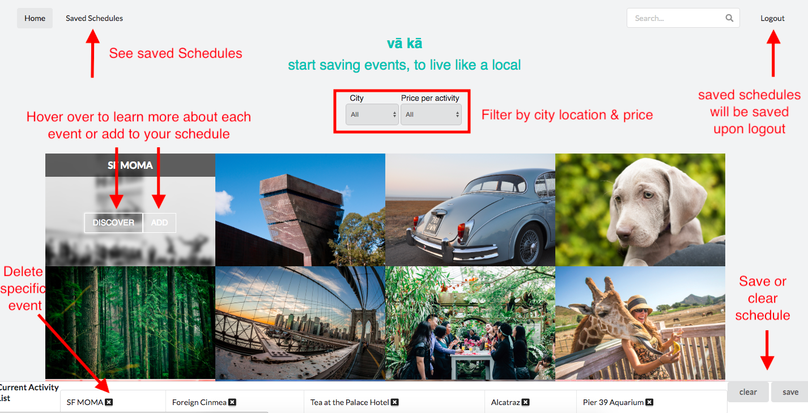
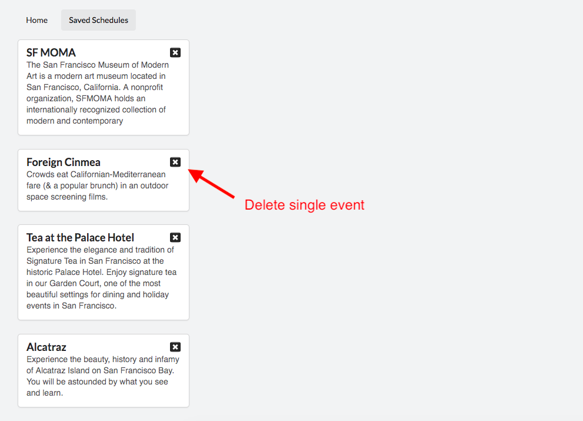

# vā kā
Q3 Project - Full stack React app

## Deployed URL: https://va-ca.herokuapp.com/

## What are you looking at?
vā kā is your solution to easily browse and save events in major cities.

## Installation
1. yarn install
2. yarn start

## Technologies:
Front-end: JavaScript, React, CSS Framework

## Technical Requirements:
### Frontend

- [x] Allow for users to be able to interact with the site.
- [x] Use React.js or another front-end framework.
- [x] Include some client-side validation.
- [x] Have your frontend interact with routes via AJAX.
- [x] Have a separate project directory and GitHub repository for your frontend.
- [x] Deploy your site.
- [ ] Have full test coverage.

### Additional

- [ ] Use a linter or style-guide for code quality
- [x] Create a physical project planning board in the EDU space with post it notes
- [x] Make multiple commits with readable commit messages
- [x] Include a readme with installation instructions and screenshots
- [x] Add your project to an online portfolio
- [x] Present your project

### Stretch

- [ ] Use Redux and Routing.
- [ ] TDD the frontend.
- [ ] Utilize a 3rd party API.

## User Experience

